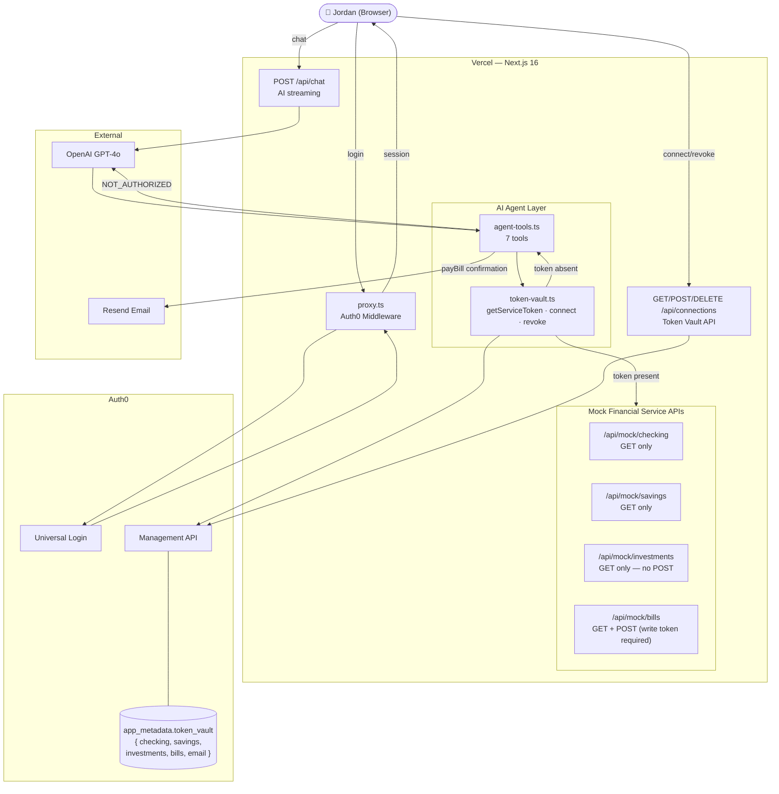

# FinEasy — AI Personal Finance Agent

> Built for the [Auth0 "Authorized to Act" Hackathon](https://authorizedtoact.devpost.com/) 

FinEasy is an AI-powered personal finance agent that monitors accounts, analyzes spending, tracks bills, and pays them on your behalf — while keeping you in complete control of what it can access.

Built on **Auth0 Token Vault** (Auth0 for AI Agents), each financial service gets its own isolated token with explicit read or write scope. The agent can view your investment portfolio but **cannot trade**. It can pay bills — but only with your explicit authorization and only using the write-scoped bills token.

---

## How It Works

1. **Login** with Auth0 — your identity is verified before anything else
2. **Connect services** — choose which financial services the agent can access. Each gets its own token with the minimum required scope (read or write)
3. **Ask in plain English** — "Analyze my spending this month", "What bills are due?", "Pay my Netflix bill"
4. **Stay in control** — every agent action is recorded in the **Activity Log** (top nav bar). Revoke any service instantly

---

## Read vs. Write Scope — The Key Security Story

| Service | Scope | What the Agent Can Do |
|---|---|---|
| Checking Account | **Read** | View balance, transactions |
| Savings Account | **Read** | View balance, transfer history |
| Investment Portfolio | **Read** | View positions, performance — **cannot trade** |
| Bill Payment | **Write** | View bills + pay them on your behalf |
| Email Alerts | **Read** | Send alerts and confirmations to your inbox |

The Bills service is the **only write-scoped token**. Even if an attacker had your checking or investments token, they cannot pay bills or execute trades — those endpoints either require a write token or simply don't exist.

---

## Tech Stack

| Layer | Technology |
|---|---|
| Framework | Next.js 16 (App Router, TypeScript) |
| AI Model | GPT-4o via OpenAI |
| AI SDK | Vercel AI SDK v6 (`ai`, `@ai-sdk/react`, `@ai-sdk/openai`) |
| Authentication | Auth0 (`@auth0/nextjs-auth0` v4) |
| Token Vault | Auth0 for AI Agents (Management API) |
| Styling | Tailwind CSS |
| Email | Resend |
| Deployment | Vercel |

---

## Project Structure

```
fin-easy/
├── app/
│   ├── page.tsx                        # Landing page
│   ├── api/
│   │   ├── chat/route.ts               # AI agent streaming endpoint
│   │   ├── connections/route.ts        # Token Vault connect/revoke API
│   │   └── mock/                       # Mock financial service APIs
│   │       ├── checking/route.ts
│   │       ├── savings/route.ts
│   │       ├── investments/route.ts    # GET only — no POST (cannot trade)
│   │       └── bills/route.ts          # GET (read) + POST (write-token required)
│   └── dashboard/
│       ├── page.tsx                    # Main chat + connections panel
│       ├── dashboard-client.tsx
│       ├── connections/page.tsx        # Service management page
│       └── help/page.tsx
├── components/
│   ├── chat/                           # Chat UI components
│   ├── connections/                    # Service connection UI
│   └── ui/                            # Shared UI (ErrorBoundary)
├── lib/
│   ├── auth0.ts                        # Auth0Client setup
│   ├── token-vault.ts                  # Token Vault helpers (get/connect/revoke)
│   ├── agent-tools.ts                  # AI agent tool definitions
│   └── services/
│       ├── mock-data.ts                # Demo seed data + validateWriteToken
│       └── resend.ts                   # Email (spending alerts, bill confirmations)
├── data/
│   └── demo-user.json                  # Jordan Chen — demo user profile
├── proxy.ts                            # Auth0 middleware (Next.js 16)
└── types/index.ts
```

---

## Setup

### 1. Clone and install

```bash
git clone <repo>
cd fin-easy
npm install
```

### 2. Configure environment variables

```bash
cp .env.local.example .env.local
```

Edit `.env.local`:

```bash
# Auth0 v4 — just the domain, no https://
AUTH0_DOMAIN=your-tenant.auth0.com
AUTH0_CLIENT_ID=
AUTH0_CLIENT_SECRET=
AUTH0_SECRET=                    # openssl rand -hex 32
AUTH0_BASE_URL=http://localhost:3000

# Auth0 M2M — for Token Vault (Management API)
AUTH0_MGMT_CLIENT_ID=
AUTH0_MGMT_CLIENT_SECRET=

# AI
OPENAI_API_KEY=

# Email (optional — demo works without it)
RESEND_API_KEY=

# App
NEXT_PUBLIC_APP_URL=http://localhost:3000

# Demo tokens
DEMO_CHECKING_TOKEN=demo_checking_token_abc123
DEMO_SAVINGS_TOKEN=demo_savings_token_def456
DEMO_INVESTMENTS_TOKEN=demo_investments_token_ghi789
DEMO_BILLS_TOKEN=demo_bills_token_jkl012
DEMO_EMAIL_TOKEN=demo_email_token_mno345
```

### 3. Configure Auth0

In the [Auth0 Dashboard](https://manage.auth0.com):

**Regular Web App:**
- Allowed Callback URLs: `http://localhost:3000/auth/callback`
- Allowed Logout URLs: `http://localhost:3000`

**M2M Application (for Token Vault):**
- Authorize against the Auth0 Management API
- Required scopes: `read:users`, `update:users`, `read:users_app_metadata`, `update:users_app_metadata`

### 4. Run

```bash
npm run dev
```

Open [http://localhost:3000](http://localhost:3000)

---

## Demo Walkthrough

Demo user: **Jordan Chen** — Software Engineer, San Francisco

- **Checking:** Chase ····4821 · $4,247.83
- **Savings:** Chase ····9374 · $18,500.00
- **Portfolio:** Robinhood · $32,450 (AAPL, MSFT, VTI, QQQ, NVDA)
- **Upcoming bills:** Rent $2,400 · PG&E $87.50 · Comcast $59.99 · Netflix $15.99 · Spotify $9.99

### Happy path

1. Login → Connect all five services
2. Ask: *"What's my checking account balance?"* → balance + recent transactions
3. Ask: *"Analyze my spending this month"* → category breakdown, top merchants, anomalies flagged
4. Ask: *"What bills do I have coming up?"* → sorted list with due dates
5. Ask: *"Pay my Netflix bill"* → agent states name + amount → confirm → pays → email confirmation sent

### Security demo (Token Vault showcase)

1. **Revoke** the Bills service
2. Ask: *"Pay my Spotify bill"* → `NOT_AUTHORIZED` — agent explains and links to Connections
3. **Reconnect** Bills → same question → works immediately

### Read-only demo (scope enforcement)

1. Ask: *"Buy 10 more shares of AAPL"* → agent explains the investments token is read-only
2. The `/api/mock/investments` route has **no POST handler** — it's architecturally impossible to trade, not just a policy

---

## Agent Tools

| Tool | Service | Scope | Description |
|---|---|---|---|
| `getAccountBalance` | Checking or Savings | Read | Balance + recent transactions |
| `getTransactions` | Checking | Read | Transaction history with category filter |
| `analyzeSpending` | Checking | Read | Category breakdown, top merchants, anomaly detection |
| `getInvestmentPortfolio` | Investments | Read | Positions, performance, allocation |
| `getBills` | Bills | Read | Upcoming bills sorted by due date |
| `payBill` | Bills | **Write** | Pay a bill — requires explicit user confirmation |
| `sendSpendingAlert` | Email | Read | Send alert or summary to user's email |

---

## Token Vault Architecture




---

## Deployment

```bash
vercel deploy
```

Set all environment variables in the Vercel dashboard. Update `AUTH0_BASE_URL` and Auth0 callback/logout URLs to your production domain.

---

## License

MIT
